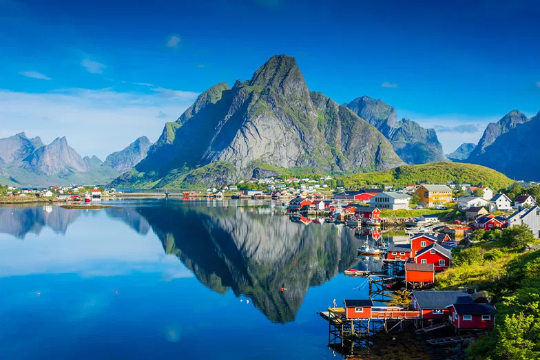

<div align="center">

# 🇳🇴✨ Conheça Noruega  
### Uma experiência visual, moderna e interativa sobre os destinos mais incríveis do país nórdico

<br>



<br><br>

[]()
[]()
[]()

</div>

---

# 📖 Sumário

- [📌 Sobre o Projeto](#-sobre-o-projeto)
- [🖼️ Prévia do Site](#️-prévia-do-site)
- [✨ Funcionalidades](#-funcionalidades)
- [🗺️ Seções do Site](#️-seções-do-site)
- [📂 Estrutura de Pastas](#-estrutura-de-pastas)
- [🛠️ Tecnologias Utilizadas](#-tecnologias-utilizadas)
- [🚀 Como Executar](#-como-executar)
- [👨‍💻 Autor](#-autor)
- [📜 Licença](#-licença)

---

# 📌 Sobre o Projeto

O **Conheça Noruega** é um website moderno e imersivo criado para apresentar três dos lugares mais impressionantes da Noruega:

- Trolltunga  
- Geirangerfjord  
- Lofoten  

O site possui:

✔ design visual premium  
✔ animações suaves  
✔ efeitos interativos nas imagens  
✔ background em céu estrelado animado  
✔ navegação suave entre sessões  
✔ layout responsivo e elegante  

Tudo feito apenas com **HTML e CSS**, provando o poder do front-end bem construído.

---

# 🖼️ Prévia do Site

> Insira aqui um screenshot do site (opcional)

<div align="center">

</div>

---

# ✨ Funcionalidades

### 🌌 **Background animado com céu estrelado**
Um visual moderno e atmosférico, com estrelas se movendo suavemente pelo fundo.

### 🧭 **Header fixo com navegação suave**
- Links para cada seção  
- Efeito hover  
- Totalmente responsivo  

### 🎨 **Design Premium**
- Cores elegantes  
- Efeitos de vidro (glassmorphism)  
- Tipografia limpa e moderna  

### 🖱️ **Imagens com animação ao passar o mouse**
- Zoom suave  
- Efeito flutuante  
- Sombra dinâmica  

### ⛰️ **Conteúdo detalhado**
Cada destino possui:
- Descrição completa  
- Curiosidades reais  
- Imagem ilustrativa  

---

# 🗺️ Seções do Site

## 🏔️ 1. Trolltunga — A Língua do Troll

Formação rochosa espetacular localizada a mais de 1.100 metros sobre o fiorde.  
Um dos cenários mais cinematográficos da Noruega.

**Curiosidade:**  
A trilha até Trolltunga só se tornou acessível ao público em 2010.

---

## 🌊 2. Geirangerfjord — O Fiorde dos Sonhos

Patrimônio Mundial da UNESCO, famoso pelas “Sete Irmãs”, uma formação de sete cachoeiras lado a lado.

**Curiosidade:**  
A lenda diz que as Sete Irmãs se apaixonaram por uma cachoeira solitária chamada “O Pretendente”.

---

## ❄️ 3. Lofoten — O Arquipélago dos Sonhos

Montanhas pontudas, vilas coloridas e uma das melhores regiões do mundo para ver a Aurora Boreal.

**Curiosidade:**  
As temperaturas são surpreendentemente “quentes” por causa da Corrente do Golfo.

---

# 📂 Estrutura de Pastas


---

# 🛠️ Tecnologias Utilizadas

<div align="center">

| Tecnologia | Usada Para |
|-----------|------------|
| **HTML5** | Estrutura do site |
| **CSS3**  | Estilo, animações, layout |
| **Flexbox** | Layout responsivo |
| **Transições & Hover** | Efeitos nas imagens |
| **Glassmorphism** | Header elegante |
| **Keyframes** | Animação das estrelas |

</div>

---

# 🚀 Como Executar

### 🔧 1. Clone o repositório:
```bash
git clone https://github.com/seu-usuario/seu-repo.git
